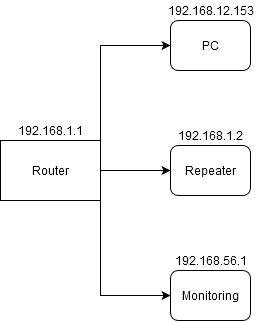

## System operacyjny w środowisku sieciowym

### Zadania

1. Z wykorzystaniem maszyny wirtualnej, zainstaluj SO oraz wypisz parametry konfiguracji IP tj:
   * Adres
   * Maska
   * Adres bramy
   * DNS 1
   * DNS 2
    
    Powyższe parametry uzyskaj na wszystkich z wymienionych systemów

   * [Linux Alpine](https://alpinelinux.org/)
   * [Linux Debian](https://www.debian.org/)
   * [Linux CentOS](https://www.centos.org/)
   * Windows 

2. Sprawdź oraz przygotuj charakterystykę dla przykładowego urządzenia w Twojej sieci domowej
   * Adres
   * Maska
   * Adres bramy
   * DNS 1
   * DNS 2
  
    Przygotuj dokumentację graficzną Twojej sieci domowej, uwzględnij adresy i urządzenia

3. Zarejestruj konto w CISCO Academy celem pobrania Packet tracer 
   https://www.netacad.com/courses/packet-tracer

4. Dlaczego umiejętnosci z zakresu sieci komputerowych mogą mi się przydać? :)

### Charakterystyka systemu operacyjnego

| Charakterystyka           | wartość               | komentarzu                |
| -------------             |:-------------:        | -----:                    |
| nazwa                     | linux                 | centos 7                  |
| cfg interfejsów           | centos 7 | /etc/sysconfig/network-scripts         |
| program (parametry sieci) | niewiem               |                           |
| ....                      | .....                 |                           |
| nazwa                     | Alpine Linux          |                           |
| Konfiguracja ip           | ``$ ip all ``         | show all eth interfaces   | 
| Tablica routingu          | ``$ ip route show ``  | what is gateway?!         | 
| check nameservers (DNS)   | ``$ cat /etc/resolv.conf ``  | which DNS were set | 

### Konfiguracja połączenia sieciowego

| Parametr | wartość           | komentarzu |
| ------------- |:-------------:| -----:|
| Adres IP      | 10.0.2.15        | przydzielony przez DHCP |
| Maska podsieci| 10.0.2.15/**24** | **255.255.255.0**    |
| Brama         | 10.0.2.2         | default from route table |
| DNS 1         | 10.10.4.204      | cat /etc/resolv.conf     |
| DNS 2         | 1.1.1.1          | nslookup uek.krakow.pl   |

### Schemat sieci

## Sieć domowa - PC

| Parametr | wartość           |
| ------------- |:-------------:|
| Adres IP      | 192.168.12.153|
| Maska podsieci| 255.255.255.0 |
| Brama         | 192.168.12.1  |
| DNS 1         | 192.168.12.1  |

## Dlaczego umiejętności z zakresu sieci komputerowych mogą mi się przydać?
Rosnąca popularność IoT na pewno skłoni mnie do większej uwagi na ten przedmiot. Ponadto umiejętności te są kluczowe dla większości systemów opartych na Linuxie, więc uważam, że bez nich się nie obejdzie. :)

